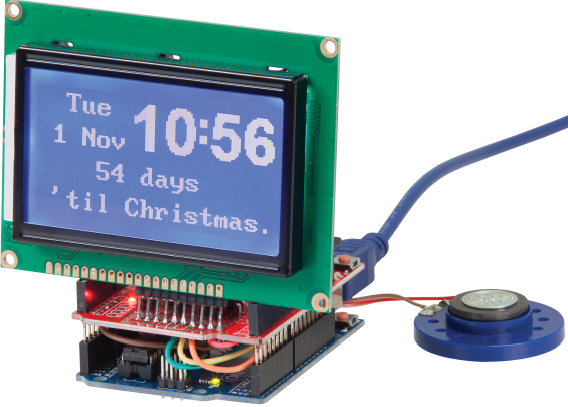
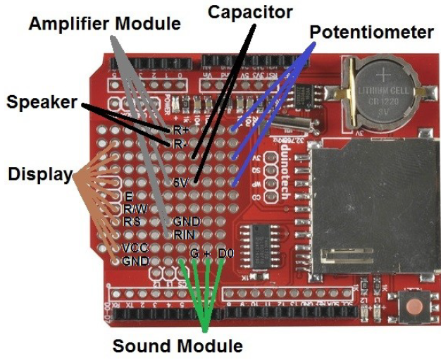
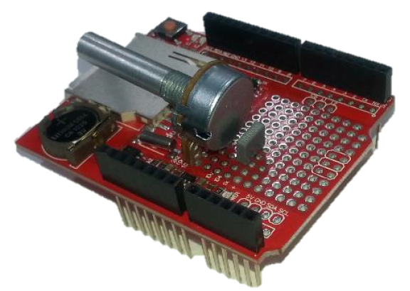
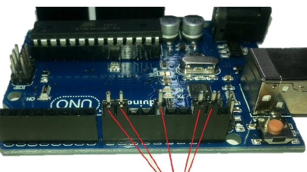
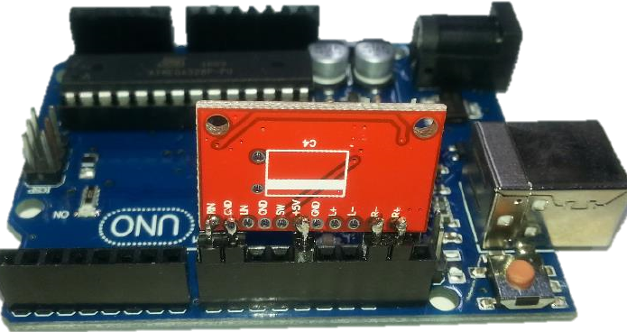
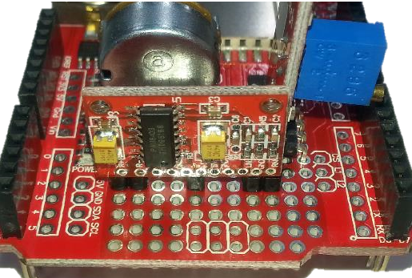
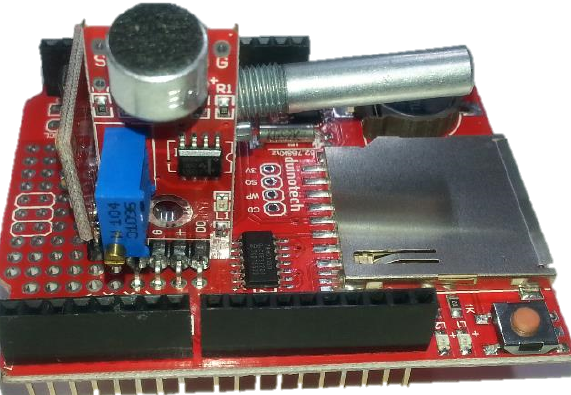
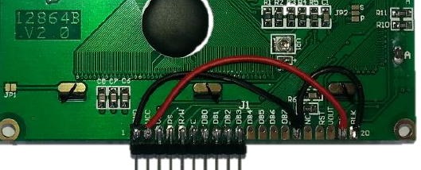
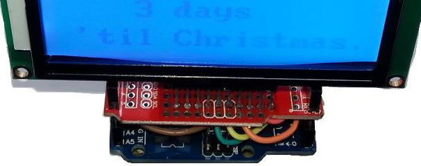
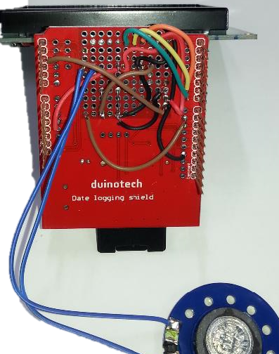

Christmas Countdown Clock

_Project 00008_

This project probably has the most parts of any of the ones we have done, but is sure to help spread some
Christmas joy. It's a clock which displays the time and date, and also displays the number of days until
Christmas. When the sound module is triggered, a voice (it might be Santa) announces the number of days and
weeks until Christmas and then offers a Christmassy greeting. It's sure to keep everyone entertained. There is
some soldering and careful assembly required to compete this project.

## Bill of Materials
| Qty | Code | Description |
| --- | --- | ---|
|1 | [XC4410](http://jaycar.com.au/p/XC4410) | UNO board
|1 | [XC4536](http://jaycar.com.au/p/XC4536) | Datalogging shield
|1 | [XC4617](http://jaycar.com.au/p/XC4617) | Dot Matrix LCD display
|1 | [XC4438](http://jaycar.com.au/p/XC4438) | Sound sensor
|1 | [XC4448](http://jaycar.com.au/p/XC4448) | Amplifier
|1 | [RP7504](http://jaycar.com.au/p/RP7504) | 1k potentiometer
|1 | [RM7125](http://jaycar.com.au/p/RM7125) | 100nF polyester cap
|1 | [HM3212](http://jaycar.com.au/p/HM3212) | 40way header strip
|1 | [AS3004](http://jaycar.com.au/p/AS3004) | Miniture speaker
|1 | [XC4998](http://jaycar.com.au/p/XC4998) | 2GB SD card

* You'll also need about a metre of insulated wire - if you don't have any spare, our [XC3010](http://jaycar.com.au/p/XC3010) will work.

## Connection Table

Here's a diagram of where various modules will mount

|UNO/Shield | LCD | Amplifier | sound module | potentiometer|
|---|--- |--- |--- | --- | 
| GND | LCD pin 1 | GND | G | pin closest to sound module |
|5V | LCD pin 2 (VCC) | 5V | + | |
|D9 | | | |pin not connected to cap|
|D5 | LCD 4 (RS) | | | |
|D6 | LCD 5 (R/W) | | | |
|D7| LCD 6 (E) | | | |
|A3 | | |D0| |

Also some connections go directly between the modules:

| From | To |
| ---|--- |
| potentiometer (middle)| Amplifier (RIN)
| R+ | AS3004 speaker
| R- | AS3004 speaker

## Downloads
* [Christmas Sounds](Christmas_Sounds.zip)
* [RTC setting](XC4536_Setting.zip)

## Software Libraries
|Library | Author
| --- |--- |
|TMRpcm | TMRh20 |
|RTCLib | Adafruit |

## Assembly

We'll start by mounting the potentiometer and capacitor onto the Datalogging Shield. Before cutting off the excess lead on the capacitor, bend and solder them over to join onto the two legs of the potentiometer as shown, then cut off.

The Amplifier Module is next. Because it has a different pin spacing, start by breaking 2 lots of 2 pins and a single pin from the HM3212, and place them in the Uno board in the sockets for D8/D9, D12 and AREF/SDA (SDA may not be marked). This will be our jig for soldering the headers onto the board, and will ensure that the module will fit.

Now we can lift the entire assembly out and mount in the Datalogging Shield as shown below, and solder the
header pins in place. Make sure the Amplifier Module is facing as shown- it definitely won't work if it is turned around.

then mount and solder the sound module system

### Display Module
For the Display Module, break off a group of ten pins from the HM3212 Header Strip, and solder vertically to pins 1-10 on the back of the Display Module. Then run a wire from GND (pin 1) to PSB (pin 15) and BLK (pin 20) on the back of the Display Module, and another wire from VCC (pin 2) to BLA (pin 19). We've used different colours to help distinguish the wires, but that is not critical to operation of the Clock.

Then mount and solder onto the datalogging shield as shown:

The final constructions step is to turn the assembled shield over, and make all the wiring connections.

## Programming
Download the source code and extract into a new folder, open the .ino file in the Arduino IDE and press upload.

when you first use the sketch, you'll notice that the time/date might be wrong. use the RTC setting in the downloads section to correct the time, and then try the source code again.

There will be two adjustments to make- the first is the sensitivity of the Sound Module. We want the L2 LED to be flickering between on at the slightest sound. If the L2 LED is on, turn the brass screw anticlockwise. If L2 is off, turn the screw clockwise until it turns on, then turn anti-clockwise until it just goes off. The LED should now flash on if the microphone is tapped. If you would like it to be less sensitive to sounds, it can be turned further anticlockwise.

If the sound doesn't trigger when L2 flashes on, the Sound Module may not be wired correctly.
The second adjustment is for the volume- we use the potentiometer for this. Give the microphone on the Sound Module a tap, and turn the potentiometer shaft clockwise to increase the volume. If the volume is too high, the sound may distort and damage the speaker- it should not need to be turned more than about 30 degrees to be audible. You may need to keep triggering the sound to keep adjusting the volume. When the Clock is speaking, it should read out the number of days and weeks until Christmas, and then give a random greeting. If the sound is heavily distorted or there is a high pitched background noise, there may be a wiring problem with the potentiometer, capacitor or amplifier module.

## Use

## Future Improvements
